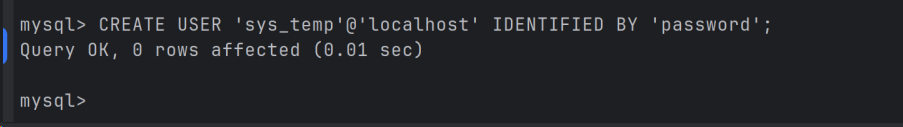
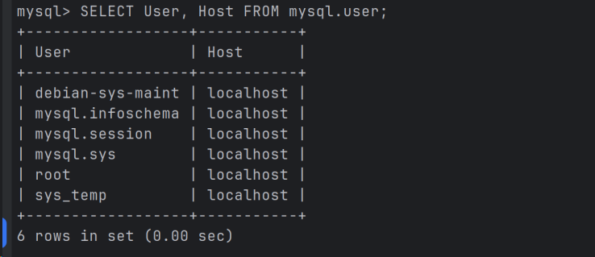
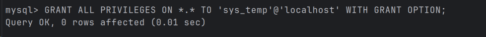
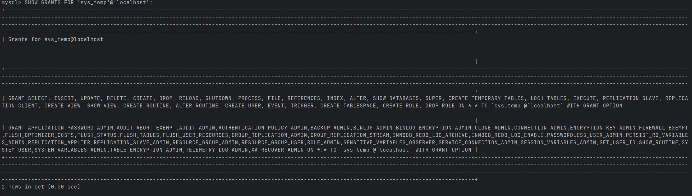
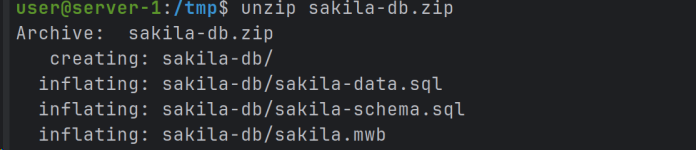
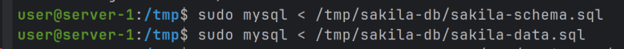
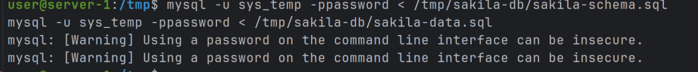
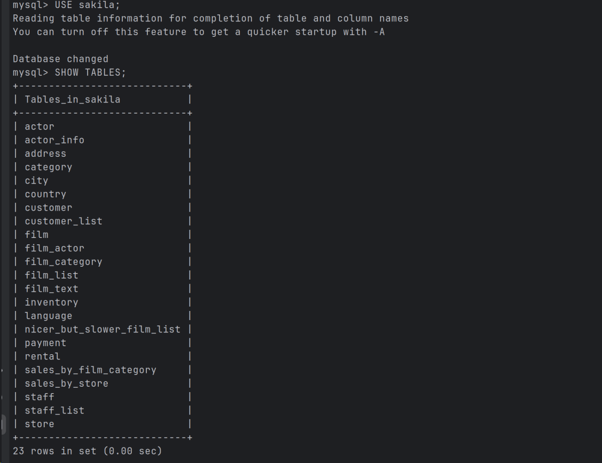
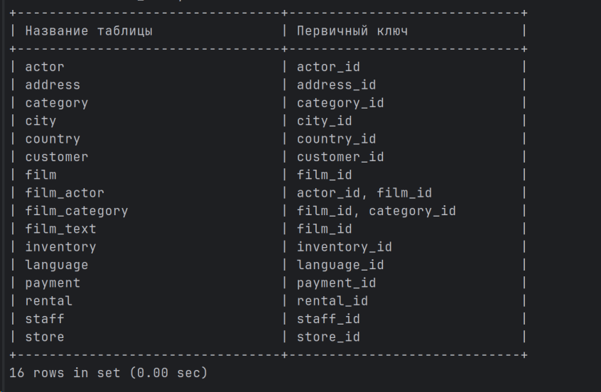
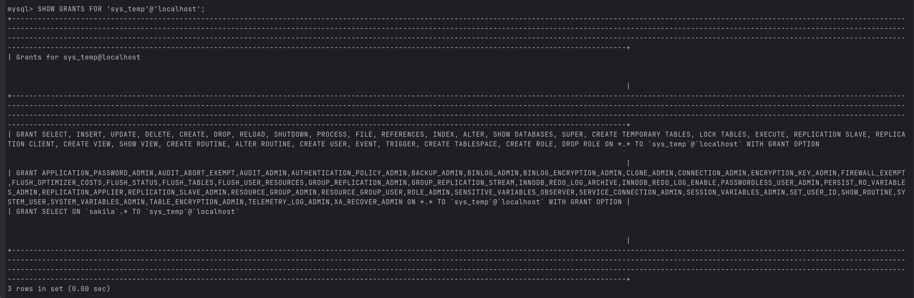

# Домашнее задание к занятию «Работа с данными (DDL/DML)»

### Инструкция по выполнению домашнего задания

1. Сделайте fork [репозитория c шаблоном решения](https://github.com/netology-code/sys-pattern-homework) к себе в Github и переименуйте его по названию или номеру занятия, например, https://github.com/имя-вашего-репозитория/gitlab-hw или https://github.com/имя-вашего-репозитория/8-03-hw).
2. Выполните клонирование этого репозитория к себе на ПК с помощью команды `git clone`.
3. Выполните домашнее задание и заполните у себя локально этот файл README.md:
    - впишите вверху название занятия и ваши фамилию и имя;
    - в каждом задании добавьте решение в требуемом виде: текст/код/скриншоты/ссылка;
    - для корректного добавления скриншотов воспользуйтесь инструкцией [«Как вставить скриншот в шаблон с решением»](https://github.com/netology-code/sys-pattern-homework/blob/main/screen-instruction.md);
    - при оформлении используйте возможности языка разметки md. Коротко об этом можно посмотреть в [инструкции по MarkDown](https://github.com/netology-code/sys-pattern-homework/blob/main/md-instruction.md).
4. После завершения работы над домашним заданием сделайте коммит (`git commit -m "comment"`) и отправьте его на Github (`git push origin`).
5. Для проверки домашнего задания преподавателем в личном кабинете прикрепите и отправьте ссылку на решение в виде md-файла в вашем Github.
6. Любые вопросы задавайте в разделе «Вопросы по заданию» в личном кабинете.

Желаем успехов в выполнении домашнего задания.

---

Задание можно выполнить как в любом IDE, так и в командной строке.

### Задание 1
1.1. Поднимите чистый инстанс MySQL версии 8.0+. Можно использовать локальный сервер или контейнер Docker.

1.2. Создайте учётную запись sys_temp.

1.3. Выполните запрос на получение списка пользователей в базе данных. (скриншот)

1.4. Дайте все права для пользователя sys_temp.

1.5. Выполните запрос на получение списка прав для пользователя sys_temp. (скриншот)

1.6. Переподключитесь к базе данных от имени sys_temp.

Для смены типа аутентификации с sha2 используйте запрос:
```sql
ALTER USER 'sys_test'@'localhost' IDENTIFIED WITH mysql_native_password BY 'password';
```
1.6. По ссылке https://downloads.mysql.com/docs/sakila-db.zip скачайте дамп базы данных.

1.7. Восстановите дамп в базу данных.

1.8. При работе в IDE сформируйте ER-диаграмму получившейся базы данных. При работе в командной строке используйте команду для получения всех таблиц базы данных. (скриншот)

*Результатом работы должны быть скриншоты обозначенных заданий, а также простыня со всеми запросами.*

---
### Ответ
1.1.
```bash
sudo apt update && sudo apt upgrade -y
sudo apt install mysql-server -y
sudo systemctl start mysql
sudo systemctl enable mysql
sudo mysql_secure_installation
sudo mysql
```


1.2.
```sql
CREATE USER 'sys_temp'@'localhost' IDENTIFIED BY 'password';
```


1.3.
```sql
SELECT User, Host FROM mysql.user;
```


1.4.
```sql
GRANT ALL PRIVILEGES ON *.* TO 'sys_temp'@'localhost' WITH GRANT OPTION;
```


1.5.
```sql
SHOW GRANTS FOR 'sys_temp'@'localhost';
```


1.6.
```bash
cd /tmp
wget https://downloads.mysql.com/docs/sakila-db.zip
sudo apt install unzip
unzip sakila-db.zip
```


1.7.
```bash
sudo mysql < /tmp/sakila-db/sakila-schema.sql
sudo mysql < /tmp/sakila-db/sakila-data.sql
# или
mysql -u sys_temp -ppassword < /tmp/sakila-db/sakila-schema.sql
mysql -u sys_temp -ppassword < /tmp/sakila-db/sakila-data.sql
```

или


1.8.
```sql
USE sakila;
SHOW TABLES;
```

---

### Задание 2
Составьте таблицу, используя любой текстовый редактор или Excel, в которой должно быть два столбца: в первом должны быть названия таблиц восстановленной базы, во втором названия первичных ключей этих таблиц. Пример: (скриншот/текст)
```
Название таблицы | Название первичного ключа
customer         | customer_id
```

---
### Ответ
[Таблица.xlsx](https://github.com/user-attachments/files/23431784/default.xlsx)  
или
```sql
USE sakila;

SELECT 
    TABLE_NAME AS 'Название таблицы',
    COLUMN_NAME AS 'Название первичного ключа'
FROM 
    INFORMATION_SCHEMA.KEY_COLUMN_USAGE
WHERE 
    TABLE_SCHEMA = 'sakila'
    AND CONSTRAINT_NAME = 'PRIMARY'
ORDER BY 
    TABLE_NAME, ORDINAL_POSITION;
```

---

## Дополнительные задания (со звёздочкой*)
Эти задания дополнительные, то есть не обязательные к выполнению, и никак не повлияют на получение вами зачёта по этому домашнему заданию. Вы можете их выполнить, если хотите глубже шире разобраться в материале.

### Задание 3*
3.1. Уберите у пользователя sys_temp права на внесение, изменение и удаление данных из базы sakila.

3.2. Выполните запрос на получение списка прав для пользователя sys_temp. (скриншот)

*Результатом работы должны быть скриншоты обозначенных заданий, а также простыня со всеми запросами.*

---
### Ответ
В MySQL нельзя частично отозвать привилегии, если пользователь получил GRANT ALL (задание 1.4.). Поэтому решение такое  
3.1.  
```sql
REVOKE ALL PRIVILEGES ON *.* FROM 'sys_temp'@'localhost';
GRANT USAGE ON *.* TO 'sys_temp'@'localhost';
GRANT SELECT ON sakila.* TO 'sys_temp'@'localhost';
```
  
3.2.  

---
