# Домашнее задание к занятию «Репликация и масштабирование. Часть 1»

### Инструкция по выполнению домашнего задания

1. Сделайте fork [репозитория c шаблоном решения](https://github.com/netology-code/sys-pattern-homework) к себе в Github и переименуйте его по названию или номеру занятия, например, https://github.com/имя-вашего-репозитория/gitlab-hw или https://github.com/имя-вашего-репозитория/8-03-hw).
2. Выполните клонирование этого репозитория к себе на ПК с помощью команды `git clone`.
3. Выполните домашнее задание и заполните у себя локально этот файл README.md:
    - впишите вверху название занятия и ваши фамилию и имя;
    - в каждом задании добавьте решение в требуемом виде: текст/код/скриншоты/ссылка;
    - для корректного добавления скриншотов воспользуйтесь инструкцией [«Как вставить скриншот в шаблон с решением»](https://github.com/netology-code/sys-pattern-homework/blob/main/screen-instruction.md);
    - при оформлении используйте возможности языка разметки md. Коротко об этом можно посмотреть в [инструкции по MarkDown](https://github.com/netology-code/sys-pattern-homework/blob/main/md-instruction.md).
4. После завершения работы над домашним заданием сделайте коммит (`git commit -m "comment"`) и отправьте его на Github (`git push origin`).
5. Для проверки домашнего задания преподавателем в личном кабинете прикрепите и отправьте ссылку на решение в виде md-файла в вашем Github.
6. Любые вопросы задавайте в разделе «Вопросы по заданию» в личном кабинете.

Желаем успехов в выполнении домашнего задания.

---

### Задание 1

На лекции рассматривались режимы репликации master-slave, master-master, опишите их различия.

*Ответить в свободной форме.*

---
### Ответ
| Характеристика            | Master-Slave               | Master-Master                      |
|---------------------------|----------------------------|------------------------------------|
| Направление репликации    | Односторонняя              | Двусторонняя                       |
| Запись                    | Только на master           | На любом узле                      |
| Отказоустойчивость записи | Низкая (зависит от master) | Высокая (запись возможна на любом) |
| Риск конфликтов           | Нет                        | Есть (требует предотвращения)      |
| Сложность настройки       | Проще                      | Сложнее                            |
| Использование             | Чтение с реплик, бэкапы    | Высокая доступность, балансировк   |
---

### Задание 2

Выполните конфигурацию master-slave репликации, примером можно пользоваться из лекции.

*Приложите скриншоты конфигурации, выполнения работы: состояния и режимы работы серверов.*


---
### Ответ
```bash
#выполняем на обоих серверах
sudo apt update && sudo apt upgrade -y
sudo apt install mysql-server -y
sudo systemctl start mysql
sudo systemctl enable mysql
```

### На Master
в файле *sudo nano /etc/mysql/mysql.conf.d/mysqld.cnf* добавляем параметры
```
[mysqld]
user            = mysql
bind-address    = 0.0.0.0
mysqlx-bind-address = 127.0.0.1

# Replication
server-id       = 1
log_bin         = /var/log/mysql/mysql-bin.log
binlog_format   = ROW
max_binlog_size = 100M
binlog_expire_logs_seconds = 604800

# Logging
log_error = /var/log/mysql/error.log

# Fine Tuning
key_buffer_size = 16M
myisam-recover-options = BACKUP
```
```bash
sudo systemctl restart mysql
sudo systemctl status mysql
sudo ufw allow from 10.10.10.22 to any port 3306
sudo mysql -u root
```
```sql
CREATE USER 'repl'@'%' IDENTIFIED WITH mysql_native_password BY 'StrongPass123!';
GRANT REPLICATION SLAVE ON *.* TO 'repl'@'%';
FLUSH PRIVILEGES;
```
```bash
sudo systemctl restart mysql
```
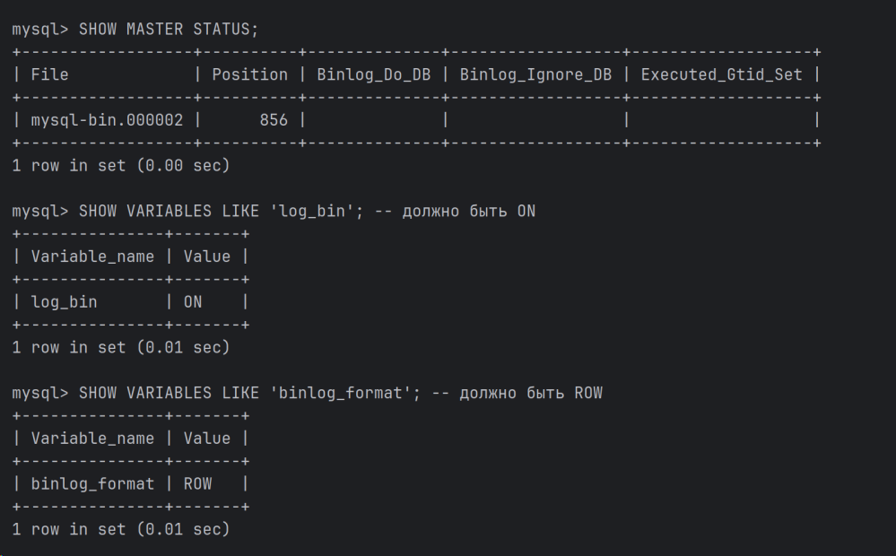

### На Slave
в файле *sudo nano /etc/mysql/mysql.conf.d/mysqld.cnf* добавляем параметры
```
[mysqld]
user            = mysql
bind-address    = 0.0.0.0
mysqlx-bind-address = 127.0.0.1

# Replication
server-id       = 2
read-only = 1
log_bin         = /var/log/mysql/mysql-bin.log
binlog_format   = ROW
max_binlog_size = 100M
binlog_expire_logs_seconds = 604800

# Logging
log_error = /var/log/mysql/error.log

# Fine Tuning
key_buffer_size = 16M
myisam-recover-options = BACKUP
```
```bash
sudo systemctl restart mysql
sudo systemctl status mysql
sudo mysql -u root
```
```sql
CREATE USER 'repl'@'%' IDENTIFIED WITH mysql_native_password BY 'StrongPass123!';
GRANT REPLICATION SLAVE ON *.* TO 'repl'@'%';
FLUSH PRIVILEGES;
```
```bash
sudo systemctl restart mysql
sudo ufw allow from 10.10.10.12 to any port 3306
sudo mysql -u root
```
```sql
CHANGE REPLICATION SOURCE TO
  SOURCE_HOST='10.10.10.12',
  SOURCE_USER='repl',
  SOURCE_PASSWORD='StrongPass123!',
  SOURCE_LOG_FILE='mysql-bin.000002',
  SOURCE_LOG_POS=856;
```
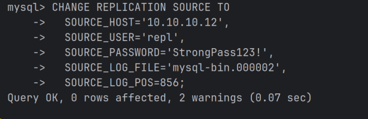

```sql
START REPLICA;
```
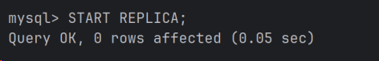
```sql
SHOW REPLICA STATUS\G
```
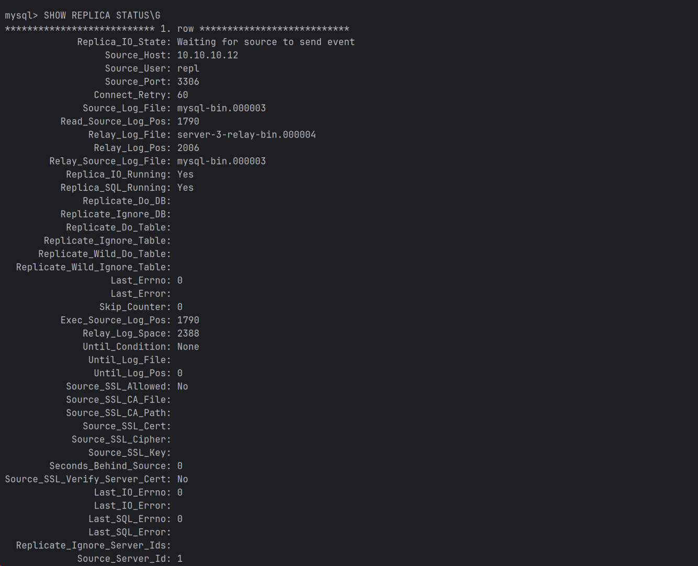
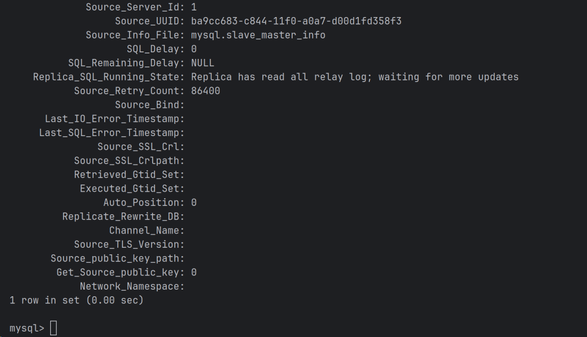

### Тестирование репликации
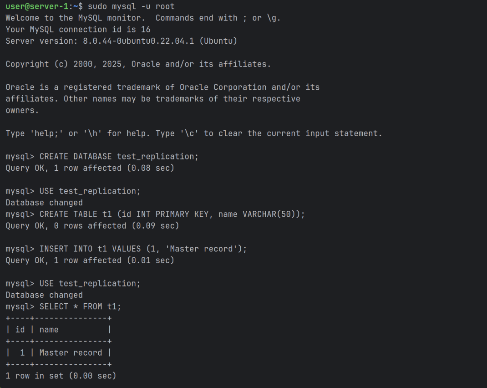
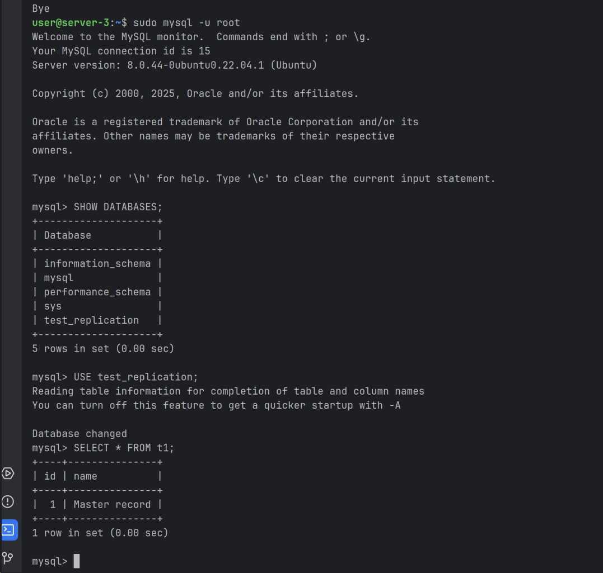
---

### Задание 3*

Выполните конфигурацию master-master репликации. Произведите проверку.

*Приложите скриншоты конфигурации, выполнения работы: состояния и режимы работы серверов.*

---
### Ответ
Меняем конфигурацию из задания 2

### На Master 1
в файле *sudo nano /etc/mysql/mysql.conf.d/mysqld.cnf* меняем параметры
```
[mysqld]
user            = mysql
bind-address    = 0.0.0.0
mysqlx-bind-address = 127.0.0.1

# Replication
server-id       = 1
log_bin         = /var/log/mysql/mysql-bin.log
binlog_format   = ROW
auto_increment_increment = 2
auto_increment_offset = 1
sync_binlog = 1
binlog_expire_logs_seconds = 604800

# Logging
log_error = /var/log/mysql/error.log

# Fine Tuning
key_buffer_size = 16M
myisam-recover-options = BACKUP
```
```bash
sudo systemctl restart mysql
sudo systemctl status mysql
```

### На Master 2
в файле *sudo nano /etc/mysql/mysql.conf.d/mysqld.cnf* меняем параметры
```
[mysqld]
user            = mysql
bind-address    = 0.0.0.0
mysqlx-bind-address = 127.0.0.1

# Replication
server-id       = 2
log_bin         = /var/log/mysql/mysql-bin.log
binlog_format   = ROW
auto_increment_increment = 2
auto_increment_offset = 2
sync_binlog = 1
binlog_expire_logs_seconds = 604800
read_only = 0

# Logging
log_error = /var/log/mysql/error.log

# Fine Tuning
key_buffer_size = 16M
myisam-recover-options = BACKUP
```
```bash
sudo systemctl restart mysql
sudo systemctl status mysql
sudo mysql -u root
```
Меняем настройки репликации на Master 2
```sql
STOP REPLICA IO_THREAD;
CHANGE REPLICATION SOURCE TO
SOURCE_HOST='10.10.10.12',
SOURCE_USER='repl',
SOURCE_PASSWORD='StrongPass123!',
SOURCE_LOG_FILE='mysql-bin.000004',
SOURCE_LOG_POS=157;
START REPLICA;
```
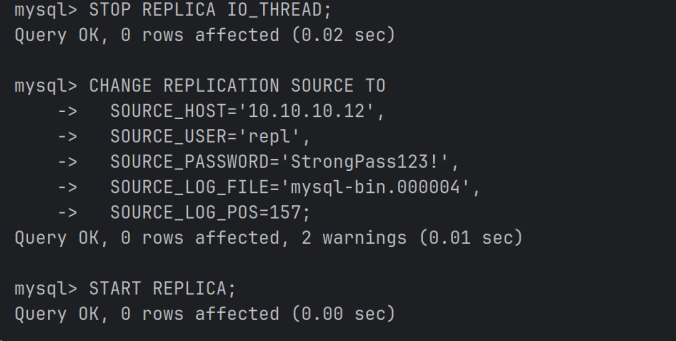

Меняем настройки репликации на Master 1
```sql
STOP REPLICA IO_THREAD;
CHANGE REPLICATION SOURCE TO
SOURCE_HOST='10.10.10.22',
SOURCE_USER='repl',
SOURCE_PASSWORD='StrongPass123!',
SOURCE_LOG_FILE='mysql-bin.000004',
SOURCE_LOG_POS=157;
START REPLICA;
```
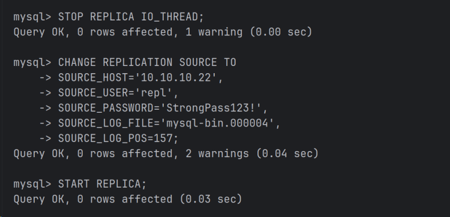

### Проверяем состояние  
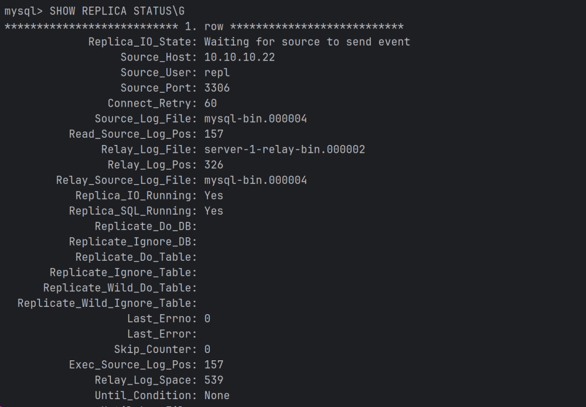


### Тестирование
На Master 1

На Master 2
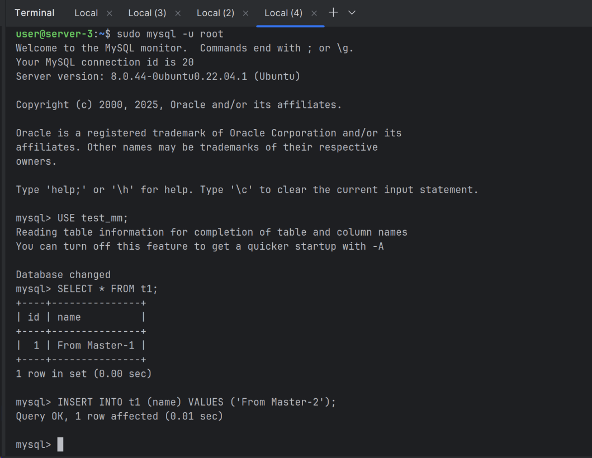
На Master 1
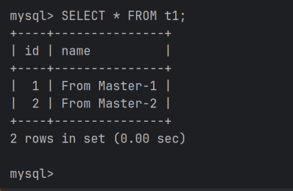

---
## Дополнительные задания (со звёздочкой*)
Эти задания дополнительные, то есть не обязательные к выполнению, и никак не повлияют на получение вами зачёта по этому домашнему заданию. Вы можете их выполнить, если хотите глубже шире разобраться в материале.