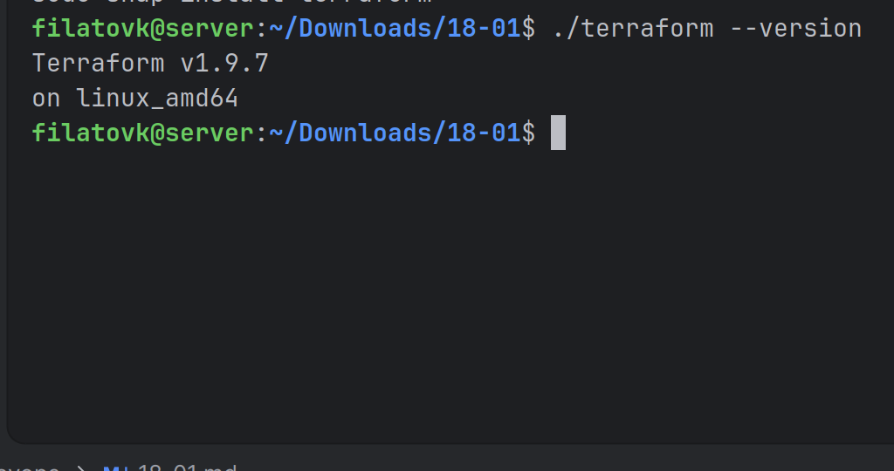
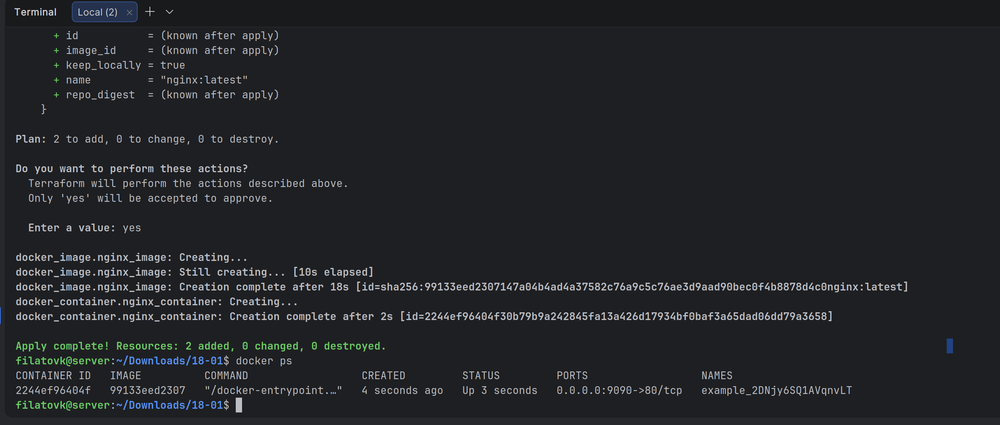
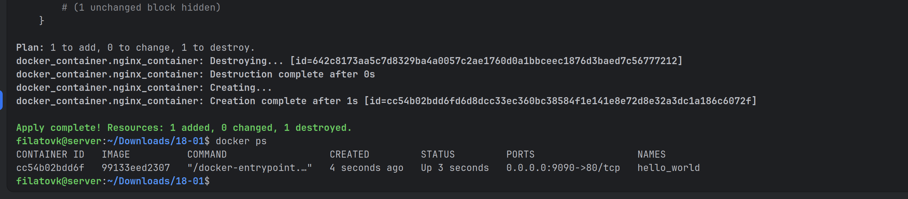
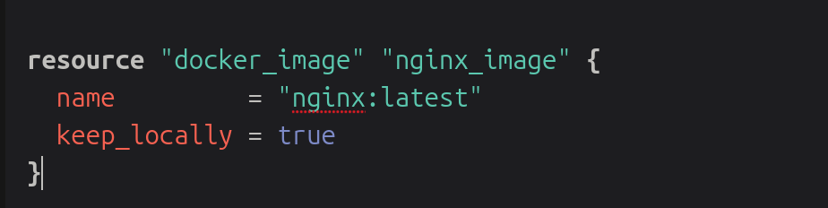
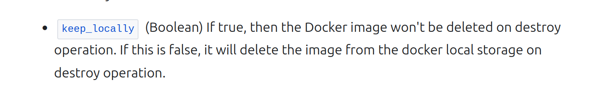

# Домашнее задание к занятию «Введение в Terraform»

### Цели задания

1. Установить и настроить Terrafrom.
2. Научиться использовать готовый код.

------

### Чек-лист готовности к домашнему заданию

1. Скачайте и установите **Terraform** версии >=1.12.0 . Приложите скриншот вывода команды ```terraform --version```.
2. Скачайте на свой ПК этот git-репозиторий. Исходный код для выполнения задания расположен в директории **01/src**.
3. Убедитесь, что в вашей ОС установлен docker.

------

### Инструменты и дополнительные материалы, которые пригодятся для выполнения задания

1. Репозиторий с ссылкой на зеркало для установки и настройки Terraform: [ссылка](https://github.com/netology-code/devops-materials).
2. Установка docker: [ссылка](https://docs.docker.com/engine/install/ubuntu/).
------
### Внимание!! Обязательно предоставляем на проверку получившийся код в виде ссылки на ваш github-репозиторий!
------

### Задание 1

1. Перейдите в каталог [**src**](https://github.com/netology-code/ter-homeworks/tree/main/01/src). Скачайте все необходимые зависимости, использованные в проекте.
2. Изучите файл **.gitignore**. В каком terraform-файле, согласно этому .gitignore, допустимо сохранить личную, секретную информацию?(логины,пароли,ключи,токены итд)
3. Выполните код проекта. Найдите  в state-файле секретное содержимое созданного ресурса **random_password**, пришлите в качестве ответа конкретный ключ и его значение.
4. Раскомментируйте блок кода, примерно расположенный на строчках 29–42 файла **main.tf**.
   Выполните команду ```terraform validate```. Объясните, в чём заключаются намеренно допущенные ошибки. Исправьте их.
5. Выполните код. В качестве ответа приложите: исправленный фрагмент кода и вывод команды ```docker ps```.
6. Замените имя docker-контейнера в блоке кода на ```hello_world```. Не перепутайте имя контейнера и имя образа. Мы всё ещё продолжаем использовать name = "nginx:latest". Выполните команду ```terraform apply -auto-approve```.
   Объясните своими словами, в чём может быть опасность применения ключа  ```-auto-approve```. Догадайтесь или нагуглите зачем может пригодиться данный ключ? В качестве ответа дополнительно приложите вывод команды ```docker ps```.
8. Уничтожьте созданные ресурсы с помощью **terraform**. Убедитесь, что все ресурсы удалены. Приложите содержимое файла **terraform.tfstate**.
9. Объясните, почему при этом не был удалён docker-образ **nginx:latest**. Ответ **ОБЯЗАТЕЛЬНО НАЙДИТЕ В ПРЕДОСТАВЛЕННОМ КОДЕ**, а затем **ОБЯЗАТЕЛЬНО ПОДКРЕПИТЕ** строчкой из документации [**terraform провайдера docker**](https://library.tf/providers/kreuzwerker/docker/latest).  (ищите в классификаторе resource docker_image )

Ответ: 
Установил более свежую версию terraform  
0. Приложите скриншот вывода команды ```terraform --version```.

1. Done
2. Согласно файлу .gitignore, личную и секретную информацию допустимо хранить в файле personal.auto.tfvars
3. Исправлена версия terraform в main
   секретное содержимое созданного ресурса - "result": "2DNjy6SQ1AVqnvLT"
4. Error: Missing name for resource (строка 22).  
   В Terraform у каждого ресурса должно быть два имени: тип ресурса и его уникальное имя в рамках конфигурации.  
   Error: Invalid resource name (строка 27).  
   В Terraform имя ресурса (второй лейбл) не может начинаться с цифры.  
5. 

resource "docker_container" "nginx_container" {
   image = docker_image.nginx_image.image_id

   name  = "hello_world"

   ports {
      internal = 80
      external = 9090
   }
}

  
6. 

-auto-approve: этот флаг пропускает этап интерактивного подтверждения изменений. Terraform сразу применяет изменения, даже если он предусматривает удаление ресурсов. Ошибка в коде может привести к необратимой потере данных.  
Зачем он нужен: используется в автоматизированных процессах (CI/CD пайплайны, скрипты развертывания), где нет возможности ввести yes вручную, и процесс должен выполняться неинтерактивно.  
7. отсутсвует -> переходим к 8
8. [terraform.tfstate](18-01/terraform.tfstate)
9. В ресурсе docker_image есть параметр keep_locally = true это инструкция провайдеру: "Не удаляй образ с локальной машины при уничтожении ресурса".  
keep_locally (Boolean) If true, then the Docker image won't be deleted on destroy operation. If this is false, it will delete the image from the docker local storage on destroy operation.  
  
https://registry.terraform.io/providers/kreuzwerker/docker/latest/docs/resources/image?spm=a2ty_o01.29997173.0.0.4ffa5171G5aWN7  
  
------

### Правила приёма работы

Домашняя работа оформляется в отдельном GitHub-репозитории в файле README.md.   
Выполненное домашнее задание пришлите ссылкой на .md-файл в вашем репозитории.

### Критерии оценки

Зачёт ставится, если:

* выполнены все задания,
* ответы даны в развёрнутой форме,
* приложены соответствующие скриншоты и файлы проекта,
* в выполненных заданиях нет противоречий и нарушения логики.

На доработку работу отправят, если:

* задание выполнено частично или не выполнено вообще,
* в логике выполнения заданий есть противоречия и существенные недостатки. 
