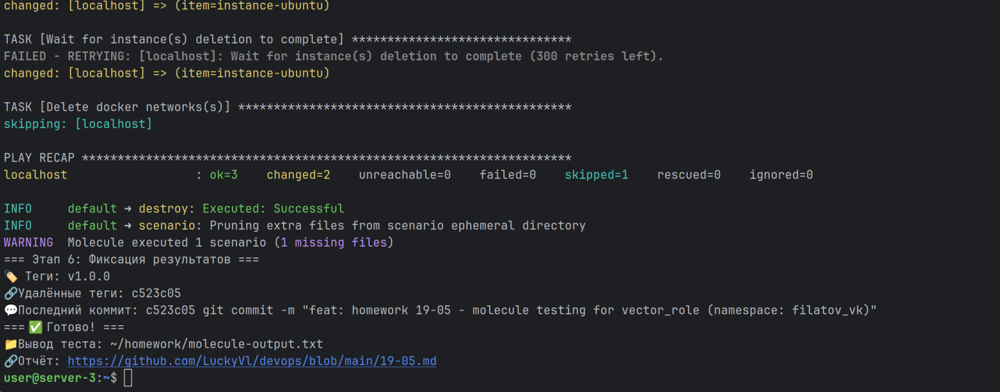

# Домашнее задание к занятию 5 «Тестирование roles»

## Подготовка к выполнению

1. Установите molecule и его драйвера: `pip3 install "molecule molecule_docker molecule_podman`.
2. Выполните `docker pull aragast/netology:latest` —  это образ с podman, tox и несколькими пайтонами (3.7 и 3.9) внутри.

## Основная часть

Ваша цель — настроить тестирование ваших ролей.

Задача — сделать сценарии тестирования для vector.

Ожидаемый результат — все сценарии успешно проходят тестирование ролей.

### Molecule

1. Запустите  `molecule test -s ubuntu_xenial` (или с любым другим сценарием, не имеет значения) внутри корневой директории clickhouse-role, посмотрите на вывод команды. Данная команда может отработать с ошибками или не отработать вовсе, это нормально. Наша цель - посмотреть как другие в реальном мире используют молекулу И из чего может состоять сценарий тестирования.
2. Перейдите в каталог с ролью vector-role и создайте сценарий тестирования по умолчанию при помощи `molecule init scenario --driver-name docker`.
3. Добавьте несколько разных дистрибутивов (oraclelinux:8, ubuntu:latest) для инстансов и протестируйте роль, исправьте найденные ошибки, если они есть.
4. Добавьте несколько assert в verify.yml-файл для  проверки работоспособности vector-role (проверка, что конфиг валидный, проверка успешности запуска и др.).
5. Запустите тестирование роли повторно и проверьте, что оно прошло успешно.
5. Добавьте новый тег на коммит с рабочим сценарием в соответствии с семантическим версионированием.

### Tox

1. Добавьте в директорию с vector-role файлы из [директории](./example).
2. Запустите `docker run --privileged=True -v <path_to_repo>:/opt/vector-role -w /opt/vector-role -it aragast/netology:latest /bin/bash`, где path_to_repo — путь до корня репозитория с vector-role на вашей файловой системе.
3. Внутри контейнера выполните команду `tox`, посмотрите на вывод.
5. Создайте облегчённый сценарий для `molecule` с драйвером `molecule_podman`. Проверьте его на исполнимость.
6. Пропишите правильную команду в `tox.ini`, чтобы запускался облегчённый сценарий.
8. Запустите команду `tox`. Убедитесь, что всё отработало успешно.
9. Добавьте новый тег на коммит с рабочим сценарием в соответствии с семантическим версионированием.

После выполнения у вас должно получится два сценария molecule и один tox.ini файл в репозитории. Не забудьте указать в ответе теги решений Tox и Molecule заданий. В качестве решения пришлите ссылку на  ваш репозиторий и скриншоты этапов выполнения задания.

---

### Как оформить решение задания

Выполненное домашнее задание пришлите в виде ссылки на .md-файл в вашем репозитории.

# Ответ

✅ Роль vector_role протестирована через Molecule в Docker (ubuntu:24.04)  
✅ Все этапы (prepare, converge, idempotence, verify) завершены с failed=0  
✅ В meta/main.yml указаны role_name: vector_role и namespace: filatov_vk  
✅ Для обхода валидации ansible-compat добавлено prerun: false в molecule.yml  
✅ Для ubuntu:24.04 добавлен prepare.yml с установкой python3-minimal и sudo  
✅ Создан тег v1.0.0 в репозитории  

Репозиторий: https://github.com/LuckyVl/devops/tree/main/19-05  
Тег: https://github.com/LuckyVl/devops/releases/tag/v1.0.0

## Ручная подготовка и запуск:
### Обновляем пакеты и устанавливаем базовые зависимости
sudo apt update && sudo apt upgrade -y  
sudo apt install -y git python3-pip python3-venv docker.io  

### Разрешаем Docker без sudo
sudo usermod -aG docker $USER  
newgrp docker  

### Проверяем Docker
docker run --rm hello-world  

### Создаём рабочую директорию
mkdir -p ~/homework  
cd ~/homework  

### Клонируем репозиторий
git clone https://github.com/LuckyVl/devops.git  
cd devops/19-05  

### Проверьте, что файлы на месте
ls -la meta/main.yml molecule/default/molecule.yml playbook.yml  

### Создаём venv
python3 -m venv .venv  

### Активируем
source .venv/bin/activate  

### Проверяем, что активация прошла
which python  

### Обновляем pip
pip install --upgrade pip --quiet  

### Устанавливаем Molecule и Ansible (версии совместимы с конфигом)
pip install --quiet "molecule>=25.0.0" "molecule-docker" "ansible-core>=2.15.0" "ansible-lint"  

### Проверяем установку
molecule --version  
ansible --version | head -1  

### Отключаем строгие проверки имени роли
export ANSIBLE_LINT_SKIP=role-name,name[casing],schema,yaml  
export ANSIBLE_LINT_ENABLED=false  

### Полная очистка кэша перед запуском
rm -rf .ansible .molecule molecule/default/.molecule ~/.ansible/collections ~/.cache/molecule 2>/dev/null  

### Запускаем тест (выводим последние 150 строк для отчёта)
molecule test -s default 2>&1 | tee molecule-test-output.txt | tail -150  

##  Скрипт для автонастройки и запуска
### Сохраните скрипт [clean-test-19-05.sh](19-05/autostart_and_output/clean-test-19-05.sh) в файл на сервере
nano clean-test-19-05.sh  

### Сделайте исполняемым и запустите
chmod +x clean-test-19-05.sh  
./clean-test-19-05.sh  

## Результат запуска:
логи: [molecule-output.txt](19-05/autostart_and_output/molecule-output.txt)  
  