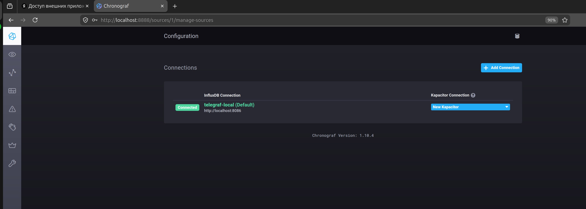
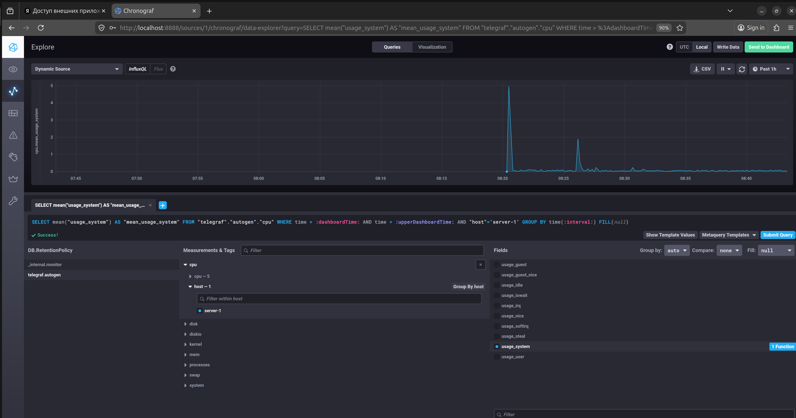

# Домашнее задание к занятию "13.Системы мониторинга"

## Обязательные задания

1. Вас пригласили настроить мониторинг на проект. На онбординге вам рассказали, что проект представляет из себя
   платформу для вычислений с выдачей текстовых отчетов, которые сохраняются на диск. Взаимодействие с платформой
   осуществляется по протоколу http. Также вам отметили, что вычисления загружают ЦПУ. Какой минимальный набор метрик вы
   выведите в мониторинг и почему?  
**Ответ:**  
Минимальные метрики: CPU usage, HTTP 2xx/5xx ratio, disk space  
Рекомендованные метрики:  
Инфраструктура: CPU usage (%), CPU load average, RAM usage, Disk I/O wait, Disk space
Сеть: Network throughput, Connection errors  
Процессы: Service uptime, Process restarts count  
Приложение: HTTP response codes (2xx/4xx/5xx), Request latency (p50/p95/p99), Requests Per Second
Бизнес-логика приложения: Reports generated/saved count, Report generation time  


2. Менеджер продукта посмотрев на ваши метрики сказал, что ему непонятно что такое RAM/inodes/CPUla. Также он сказал,
   что хочет понимать, насколько мы выполняем свои обязанности перед клиентами и какое качество обслуживания. Что вы
   можете ему предложить?  
**Ответ:**  
Система справляется с нагрузкой (CPU usage): Индикатор (Норма / Нагрузка / Перегрузка)  
Доля успешных запросов клиентов (HTTP 2xx / all): SLA дашборд (99.2%" запросов, обработаных успешно за последний час)  
Скорость получения результата клиентом (Report generation time): График (Среднее время отчета: 1.8 сек)    
Хватает ли места для новых отчетов (Disk space): Прогноз (Место закончится через "112" дней)  
Сколько клиентов ждут в очереди (Queue depth): Счётчик (5 задач в обработке, 0 в очереди)  


3. Вашей DevOps команде в этом году не выделили финансирование на построение системы сбора логов. Разработчики в свою
   очередь хотят видеть все ошибки, которые выдают их приложения. Какое решение вы можете предпринять в этой ситуации,
   чтобы разработчики получали ошибки приложения?  
**Ответ:**  
Вариант 1: Логи в stdout и сбор через Telegraf  
Вариант 2: Loki и Promtail  
Вариант 3: Алёртинг по кодам возврата и sampling  


4. Вы, как опытный SRE, сделали мониторинг, куда вывели отображения выполнения SLA=99% по http кодам ответов.
   Вычисляете этот параметр по следующей формуле: summ_2xx_requests/summ_all_requests. Данный параметр не поднимается выше
   70%, но при этом в вашей системе нет кодов ответа 5xx и 4xx. Где у вас ошибка?  
**Ответ**  
SLA = summ_2xx_requests+summ_3xx_requests/summ_all_requests  
Ошибка кроется в отсутствии 3хх ответов числителе  
  

5. Опишите основные плюсы и минусы pull и push систем мониторинга.  
**Ответ:**  
   | Критерий                   | Push                                    | Pull                             |
   | :------------------------- | :-------------------------------------- | :------------------------------- |
   | **Инициатор соединения**   | Клиент (Agent)                          | Сервер (Server)                  |
   | **Сетевая безопасность**   | Проще (исходящие с клиента)             | Сложнее (входящие на клиента)    |
   | **Динамические цели**      | **Отлично** (клиент сам регистрируется) | Сложно (нужен Service Discovery) |
   | **Кратковременные задачи** | **Идеально**                            | Затруднено                       |
   | **Надёжность доставки**    | Низкая (риск потери)                    | **Высокая**                      |
   | **Контроль над сбором**    | На стороне клиента                      | **На стороне сервера**           |
   | **Свежесть данных**        | Высокая (отправляются сразу)            | Зависит от интервала опроса      |

Лучшее решение гибридный подход (личное мнение): Prometheus, Zabbix, Grafana  


6. Какие из ниже перечисленных систем относятся к push модели, а какие к pull? А может есть гибридные?
    - Prometheus
    - TICK
    - Zabbix
    - VictoriaMetrics
    - Nagios  

**Ответ:**  
- Prometheus - Pull (основная) + Push (через Pushgateway)
- TICK - Push
- Zabbix - Pull + Push
- VictoriaMetrics - Pull + Push
- Nagios - Pull

7. Склонируйте себе [репозиторий](https://github.com/influxdata/sandbox/tree/master) и запустите TICK-стэк,
   используя технологии docker и docker-compose.

В виде решения на это упражнение приведите скриншот веб-интерфейса ПО chronograf (`http://localhost:8888`).

P.S.: если при запуске некоторые контейнеры будут падать с ошибкой - проставьте им режим `Z`, например
`./data:/var/lib:Z`
### Ответ
Развернул самостоятельно без использования docker  


8. Перейдите в веб-интерфейс Chronograf (http://localhost:8888) и откройте вкладку Data explorer.

    - Нажмите на кнопку Add a query
    - Изучите вывод интерфейса и выберите БД telegraf.autogen
    - В `measurments` выберите cpu->host->telegraf-getting-started, а в `fields` выберите usage_system. Внизу появится график утилизации cpu.
    - Вверху вы можете увидеть запрос, аналогичный SQL-синтаксису. Поэкспериментируйте с запросом, попробуйте изменить группировку и интервал наблюдений.

Для выполнения задания приведите скриншот с отображением метрик утилизации cpu из веб-интерфейса.
### Ответ


9. Изучите список [telegraf inputs](https://github.com/influxdata/telegraf/tree/master/plugins/inputs).
   Добавьте в конфигурацию telegraf следующий плагин - [docker](https://github.com/influxdata/telegraf/tree/master/plugins/inputs/docker):
```
[[inputs.docker]]
  endpoint = "unix:///var/run/docker.sock"
```

Дополнительно вам может потребоваться донастройка контейнера telegraf в `docker-compose.yml` дополнительного volume и
режима privileged:
```
  telegraf:
    image: telegraf:1.4.0
    privileged: true
    volumes:
      - ./etc/telegraf.conf:/etc/telegraf/telegraf.conf:Z
      - /var/run/docker.sock:/var/run/docker.sock:Z
    links:
      - influxdb
    ports:
      - "8092:8092/udp"
      - "8094:8094"
      - "8125:8125/udp"
```

После настройке перезапустите telegraf, обновите веб интерфейс и приведите скриншотом список `measurments` в
веб-интерфейсе базы telegraf.autogen . Там должны появиться метрики, связанные с docker.

Факультативно можете изучить какие метрики собирает telegraf после выполнения данного задания.
### Ответ
#