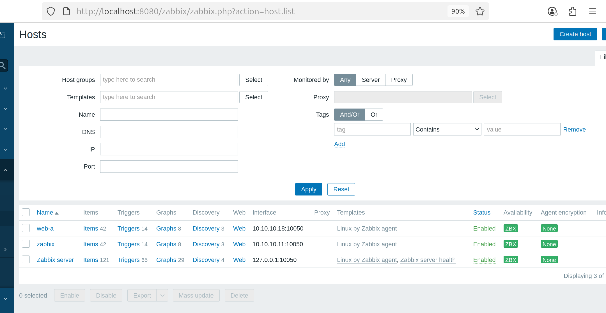
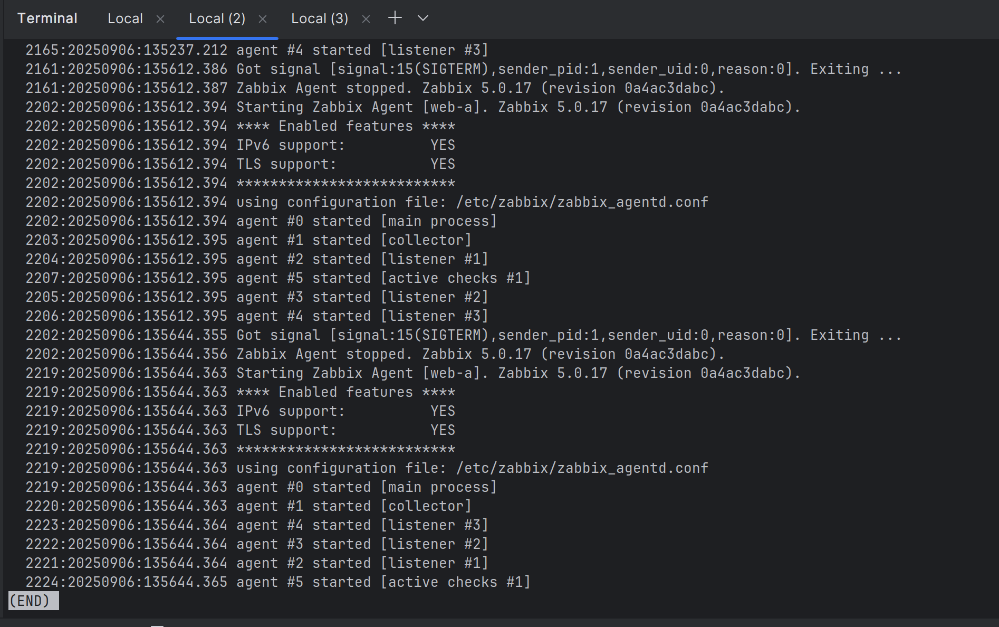

# Домашнее задание к занятию «Система мониторинга Zabbix»

---

### Задание 1

Установите Zabbix Server с веб-интерфейсом.

#### Процесс выполнения
1. Выполняя ДЗ, сверяйтесь с процессом отражённым в записи лекции.
2. Установите PostgreSQL. Для установки достаточна та версия, что есть в системном репозитороии Debian 11.
3. Пользуясь конфигуратором команд с официального сайта, составьте набор команд для установки последней версии Zabbix с поддержкой PostgreSQL и Apache.
4. Выполните все необходимые команды для установки Zabbix Server и Zabbix Web Server.

#### Требования к результатам
1. Прикрепите в файл README.md скриншот авторизации в админке.
2. Приложите в файл README.md текст использованных команд в GitHub.

**Ответ:**
```bash
# Обновление системы
sudo apt update && sudo apt upgrade -y

# Установка PostgreSQL
sudo apt install -y postgresql postgresql-contrib

# Установка Apache и PHP
sudo apt install -y apache2 php php-pgsql php-mbstring php-xml php-bcmath php-ldap php-gd php-curl

# Скачайте и установите пакет репозитория для Ubuntu 22.04 (jammy)
wget https://repo.zabbix.com/zabbix/6.0/ubuntu/pool/main/z/zabbix-release/zabbix-release_6.0-4+ubuntu22.04_all.deb
sudo dpkg -i zabbix-release_6.0-4+ubuntu22.04_all.deb
sudo apt update

# Установка Zabbix Server, Frontend и Agent с поддержкой PostgreSQL и Apache
sudo apt install -y zabbix-server-pgsql zabbix-frontend-php zabbix-apache-conf zabbix-sql-scripts zabbix-agent

# Настройка PostgreSQL !234
sudo -u postgres createuser --pwprompt zabbix
sudo -u postgres createdb -O zabbix zabbix

# Импорт начальной схемы и данных
zcat /usr/share/zabbix-sql-scripts/postgresql/server.sql.gz | sudo -u zabbix psql zabbix

# Настройка конфигурации Zabbix Server
sudo nano /etc/zabbix/zabbix_server.conf
# Устанавливаем параметры:
# DBHost=localhost
# DBName=zabbix
# DBUser=zabbix
# DBPassword=zabbix

# Перезапуск служб
sudo systemctl restart zabbix-server zabbix-agent apache2
sudo systemctl enable zabbix-server zabbix-agent apache2

# Открытие портов в фаерволе
sudo ufw allow 80/tcp
sudo ufw allow 10050/tcp
sudo ufw allow 10051/tcp

# Перезагрузка Apache
sudo systemctl reload apache2
```  


  
---

### Задание 2

Установите Zabbix Agent на два хоста.

#### Процесс выполнения
1. Выполняя ДЗ, сверяйтесь с процессом отражённым в записи лекции.
2. Установите Zabbix Agent на 2 вирт.машины, одной из них может быть ваш Zabbix Server.
3. Добавьте Zabbix Server в список разрешенных серверов ваших Zabbix Agentов.
4. Добавьте Zabbix Agentов в раздел Configuration > Hosts вашего Zabbix Servera.
5. Проверьте, что в разделе Latest Data начали появляться данные с добавленных агентов.

#### Требования к результатам
1. Приложите в файл README.md скриншот раздела Configuration > Hosts, где видно, что агенты подключены к серверу
2. Приложите в файл README.md скриншот лога zabbix agent, где видно, что он работает с сервером
3. Приложите в файл README.md скриншот раздела Monitoring > Latest data для обоих хостов, где видны поступающие от агентов данные.
4. Приложите в файл README.md текст использованных команд в GitHub

**Ответ:**  
Выполняем на zabbix (10.10.10.11)  
```bash
sudo apt update

# Устанавливаем Zabbix Agent
sudo apt install zabbix-agent -y

# Редактируем конфигурацию
sudo nano /etc/zabbix/zabbix_agentd.conf
# Server=127.0.0.1,10.10.10.11
# ServerActive=10.10.10.11
# Hostname=zabbix

# Запускаем агента
sudo systemctl restart zabbix-agent
sudo systemctl enable zabbix-agent
sudo systemctl status zabbix-agent

# Открываем порт в фаерволе
sudo ufw allow 10050/tcp
sudo ufw reload
```  

Выполняем на Web-a (10.10.10.18)  
```bash
sudo apt update

# Устанавливаем Zabbix Agent
sudo apt install zabbix-agent -y

#Конфигурурируем Web-a
sudo nano /etc/zabbix/zabbix_agentd.conf 
# Server=10.10.10.11
# ServerActive=10.10.10.11
# Hostname=web-a
 
# Запускаем агента
sudo systemctl restart zabbix-agent
sudo systemctl enable zabbix-agent
sudo systemctl status zabbix-agent
 
# Открываем порт: 
sudo ufw allow 10050/tcp
sudo ufw reload
```  

  
  
  

---
